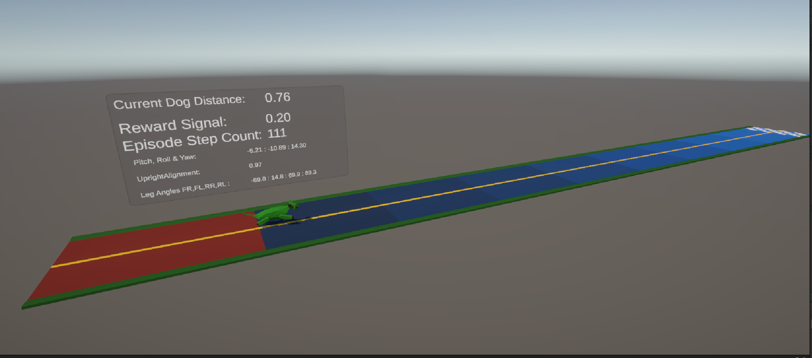
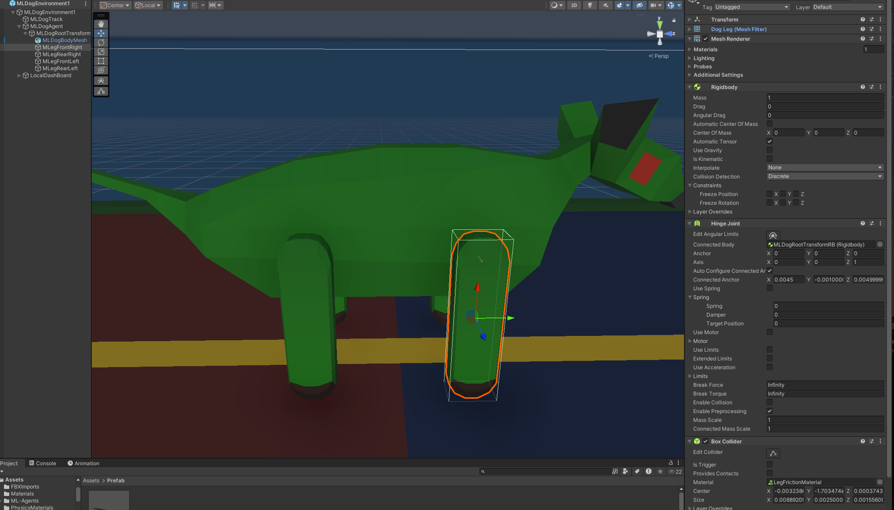
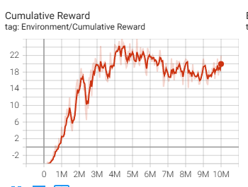

# Scatty Dog Unity ML Training

This is a very basic experiment utilising an erratic physics based dog mouse model. The Unity ML-Agents framework is used to attempt to learn some leg controls to enable the dog to run along a Track. The Dog Mouse creature is built around a very rough physics model, with hinged legs which are very difficult and erratic to control by hand.  So it will be interesting to see if the Unity ML machine learning methods can achieve what is awkard for a human to control.

This project was executed to re-aquaint with the latest Unity ML-Agents, and so could be considered used as a beginner project.   

## Video Demonstration ##
Please see this You Tube Video Demonstration [Scatty Dog Learn To Walk Video demonstration here](https://www.youtube.com/watch?v=u2F8iMBdEQ0)  

## Implementation Details ##
This experiment is based Unity Game Environment, and the use of the Unity ML framework to acheive some PPO based Reinforcement learning. 

The Dog is very simple creature consisting of a Rigid Body Body, with a Capsule Collider, and four Legs. Each of the Leg is a Rigid Body, attached to the Body via a Hinge Point. The only Actions are to Rotate each leg 10 degrees Clockwise, or 10 degrees Anticlockewise.  These are achieved through explcit local Rotational chnages, rather than by Torque etc. The Leg Box colliders and the Track, have a Physical Friction material, to avoid excessive sliding.  

The Unity Package is provided to set up and execute this experiment. You will need to import ML-Agents. 
I had to Use the Development Branch of ML-Agents (circa July 2024) as the last formal Release 21, had an issue with numpy incompatibility. 

There are only two scripts to this very basic experiment:
- MLDog.CS              :  This implements the core Dog ML Agent class and provides the interface into ML-Agents methods 
- LegControl.CS         :  This Script provides the leg control to each leg, and so implements each Leg rotation Action request.
- LocalDisplayManager   :  This is simply a utility to display some of the agents Performance and Orientation variables onto a local progress display canvas 

## Reinforcement Learning Organisation: Actions, Observations and Rewards ##

The 8 Discrete Actions available to the Dog ML-Agent are, basically Dog Rotations:

-   1: FrontRightRotateClockwise
-   2: FrontRightRotateAntiClockwise
-   3: FrontLeftRotateClockwise
-   4: FrontLeftRotateAntiClockwise
-   5: RearRightRotateClockwise
-   6: RearRightRotateAntiClockwise
-   7: RearLeftRotateClockwise
-   8: RearLeftRotateAntiClockwise

The 9x Observation Space consists of reporting upon the current Leg Rotations, the orientation of the Dogs Body, Transverse Location and Forward Progress:

-   FrontRightLegAngle
-   FrontLeftLegAngle
-   RearRightLegAngle
-   RearLeftLegAngle
-   DogPitch
-   DogRoll
-   DogYaw
-   DeltaTrackTransverse - The current Dog position.x relative to the centre line, in an attempt to keep centre
-   RunningAverageProgress - The same as the reward, and indicator of Forward. (z directional) progress 

These variables are rougthly normalised before adding as Sensor.AddObservation calls.

The reward space, is to reward forward progress along the Track foward direciton (Z Positive) with Negative rewards for toppling over and falling off the Track. With a very High reward for completing the Track.

Positive Reward Signals:
-   +5.0    : END EPISODE When Current Dog Track Distance.z exceeds 51.0, meaning the Dog has traversed along the Track Successfully 
-   +0.0001 x RunningAverageProgress  : Incrementall Add Reward Signal of a running average forward progress, window size 50 steps  
-   +0.2f Incremental Add Reward, for passing forward through + 1.0  Meters
-   +0.2f Incremental Add Reward, for passing forward through + 2.0  Meters
-   +0.25f Incremental Add Reward, for passing forward through + 5.0  Meters
-   +1.0f Incremental Add Reward, for passing forward through + 10.0  Meters
-   +2.5f Incremental Add Reward, for passing forward through + 25.0  Meters

Negative Reward Signals:
-   -5.0    : END EPISODE  for exceeding the Max Epsisode Count of 6000 Action steps
-   -2.0    : END EPISODE  for toppling over, when the Body vertical alignment differs from absolute y-Up Norm by less than 0.6
-   -5.0    : END EPISODE  for falling off the Track, when vertical y position is less than -1.0 
-   -0.5f Incremental Add Reward, for passing backward through - 1.0  Meters
-   -1.0f Incremental Add Reward, for passing backward through - 2.5 Meters

## Unity Training ##
Training through ML- Agents code. With 10 Replicated environments of Dog and Tracks to speed up Training. 
The PPO Config file is provided. The essential Training, did not require much hyper paramter tunning, for this very rough and quick experiment. So after only three Training Runs, with some acceptable training, ended up with the following hyper parameters:
-  batch_size     :  2040
-  buffer_size    :  20480
-  hidden_units   : 512
-  learning_rate  : 0.0005
-  num_layers     : 3 
-  time_horizon  : 1000

See the DogMLConfig.yaml file in teh config folder for more details.

## Observations and Discussion ##

The final Brain has been uploaded to Trained Brains, and can be used in Inference mode to replicate and run the Trained Behaviour. 

Very Little Hyper parameter tuning (was attempted) to get some basic Training, and to achieve the main objectives of Dogs getting failrly consistently to traverse along the Track.

The final behaviours are still pretty erratic leg motion, with no obvious or consistent leg motion to acheive forward motion. 

The reward performance grew fairly consistently in the early to mid training session (Up to 4.5 Million epochs)  However the Reward function deteriotated with no more consistent growth or steady reward perfomance in the later training from 5 million to 10 million epochs.  

## Acknowledgements ##

-  Unity ML Agents at:  https://github.com/Unity-Technologies/ml-agents

